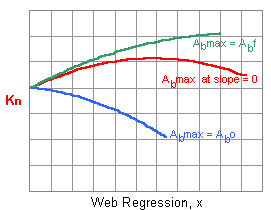

# Kn simulation

## Parameters 

- **D** is determined by the diameter of fuselage.
- **d0** is determined from the consideration of burntime. 
- **L0** is the parameter to determine the profile of Kn. 

## Effect of L0

- The neutral profile is optimal <del>because it can maintain high Kn during all the range of combustion</del> ->> The burn time may differ depending on L0. If this is true, the neutral profile is optimal because of the longest burntime with keeping relatively high Kn. See the graph below.

- The optimal grain length Lopt is calculated as follows

- For above example (D=24mm, d0=7.2mm), Lopt=39.6mm

