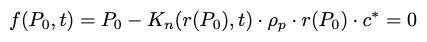

# Combustion simulation of solid rocket motor

# References
Nakka's website


# Burn rate r 
```
> burnrate
```
Burn rate r was calculated by the following formula.


Where the constant a and n are dependent on the combustion pressure. I obtained the experimental value of (a,n) from Nakka's website.


# Steady state pressure P0

```
> steady_state
```
Combustion pressure at the steady-state is the following.


The both sides of the above formula is the function of P0 (That is like, y = f(y)). To find P0, I solved the follwing equation by the [**bisection method**](https://en.wikipedia.org/wiki/Bisection_method). (the following equation is like, g(y)=y-f(y)=0)
 


Note that Klemmung Kn and burn area Ab was calculated as follows.
The formula is for BATES, where the outer surface is inhibited.


